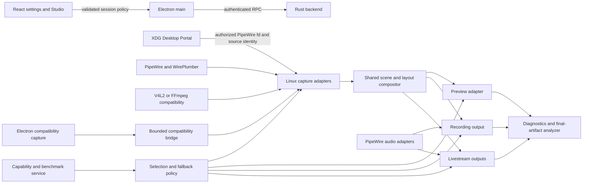

# Videorc Linux Architecture

Status: approved design for implementation planning

Initial target: Dell Latitude E7240 running PikaOS 4, GNOME Wayland, amd64

Design date: 2026-07-13

## [S1] Purpose and product promise

Videorc on Linux is a complete desktop product, not an Electron shell that merely
packages successfully. The Linux build must support screen and window capture,
camera, microphone, system audio, live preview, layouts and overlays, recording,
livestreaming, imports, clips, Noise Cleanup, and the existing AI/media workflows.

Each feature must do one of two things:

1. work through a verified Linux implementation; or
2. report an explicit capability or permission blocker with a useful recovery action.

The app must never claim native preview, hardware encoding, system-audio capture,
or another accelerated path while silently running a different implementation.

## [S2] Initial machine and support boundary

The first optimized and accepted Linux configuration is:

| Component | Initial target |
| --- | --- |
| Distribution | PikaOS 4 (`ID_LIKE=debian`, Debian Sid base) |
| Architecture | amd64 / x86_64 |
| Desktop | GNOME on Wayland |
| CPU | Intel Core i5-4310U, 2 cores / 4 threads |
| GPU | Intel Haswell integrated graphics, `i915` kernel driver |
| Hardware video | VA-API through the Haswell-compatible `i965` userspace driver |
| Memory | 12 GB RAM with zram/swap |
| Media services | PipeWire 1.6, WirePlumber, XDG Desktop Portal GNOME/GTK |
| Package | Debian `.deb` |

The first performance promise is stable 1280x720 at 30 FPS. A 1920x1080 at
30 FPS profile is offered only after the on-device benchmark and sustained smoke
prove it on this machine. No initial 4K claim is made for this hardware.

Other Debian-based distributions, desktop environments, GPUs, X11, ARM64, RPM,
Flatpak, and AppImage are later compatibility work. The modular boundaries below
must not prevent those additions, but the initial implementation is not delayed
to validate hardware the owner does not use.

## [S3] Architecture principles

- **One product pipeline, multiple adapters.** Capture and encoding choices plug
  into one scene, preview, recording, and streaming system. Videorc does not ship
  three duplicated applications.
- **Automatic first, expert control available.** A capability probe chooses a
  safe path. Advanced settings may pin a backend or forbid fallback.
- **Truthful fallback.** Every runtime path records the requested choice, selected
  choice, fallback reason, and observed implementation in diagnostics.
- **Bounded real-time work.** Frame queues are latest-wins or explicitly bounded.
  Capture cannot accumulate unbounded latency to preserve every frame.
- **Backend-owned media authority.** React configures and observes sessions; it
  does not become the production capture or encoding loop.
- **Documentation-driven TDD.** Every implementation slice starts from an approved
  requirement and a failing behavior test. Code is written only after the test
  fails for the expected reason.
- **Intent comments, not narration.** Comments explain permissions, ownership,
  synchronization, performance invariants, fallbacks, and hardware workarounds.
  They do not restate obvious code.

## [S4] System context and data flow



The XDG ScreenCast portal is the source-selection and authorization authority on
Wayland. It returns the authorized PipeWire remote and stream identity. The Rust
backend consumes the authorized stream and owns frame timing. The same scene frame
then feeds preview, recording, and livestream output so those surfaces cannot drift
into different layouts.

## [S5] Modular backend contracts

The implementation introduces small policy and adapter interfaces instead of
adding Linux conditionals throughout `recording.rs` and `main.rs`.

```rust
pub trait VideoCaptureBackend {
    fn id(&self) -> VideoCaptureBackendId;
    fn probe(&self, request: &VideoCaptureRequest) -> CapabilityVerdict;
    fn start(&self, request: VideoCaptureRequest) -> Result<VideoFrameStream>;
}

pub trait AudioCaptureBackend {
    fn id(&self) -> AudioCaptureBackendId;
    fn probe(&self, request: &AudioCaptureRequest) -> CapabilityVerdict;
    fn start(&self, request: AudioCaptureRequest) -> Result<AudioFrameStream>;
}

pub trait VideoEncoderBackend {
    fn id(&self) -> VideoEncoderBackendId;
    fn probe(&self, profile: &VideoProfile) -> CapabilityVerdict;
    fn spawn(&self, profile: VideoProfile) -> Result<EncodedVideoStream>;
}
```

These are architectural shapes, not a requirement to force synchronous Rust
traits onto asynchronous streams. The implementation plan may use async traits,
channels, or concrete enums when those give clearer ownership and easier tests.
The required contract is stable identity, a side-effect-free probe, bounded stream
ownership, explicit shutdown, and a structured failure reason.

## [S6] Screen and window capture options

| Setting | Intended use | Availability |
| --- | --- | --- |
| `automatic` | Select the best verified backend | Default |
| `pipewire-portal` | Native Wayland screen/window capture | Production primary |
| `electron-portal` | Chromium/Electron compatibility capture | Fallback |
| `ffmpeg-x11` | Direct X11 capture for later X11 hosts | Hidden when unavailable |
| `test-pattern` | Deterministic CI and diagnosis | Debug/smoke only |

`pipewire-portal` performs the XDG portal lifecycle: create session, select
sources, start, open the PipeWire remote, connect to the authorized stream, and
close the session on stop or process teardown. It prefers the portal's stable
PipeWire serial when available and treats the numeric node ID as compatibility
data rather than durable identity.

`electron-portal` exists for compatibility, not as a second product pipeline.
It uses Electron/Chromium source authorization and transfers frames through a
bounded latest-wins bridge. A JavaScript array, JSON payload, PNG, or WebSocket
queue is not acceptable for production full-frame transport.

## [S7] Camera and audio options

Camera backends:

- `automatic`: prefer PipeWire, then V4L2/FFmpeg compatibility;
- `pipewire`: consume authorized camera nodes managed by PipeWire/WirePlumber;
- `v4l2-ffmpeg`: use a selected `/dev/video*` device through the existing
  FFmpeg subprocess architecture;
- `test-pattern`: deterministic synthetic camera for CI.

Microphone backends:

- `automatic`: prefer PipeWire;
- `pipewire`: native PipeWire source;
- `pulse-compat`: FFmpeg/PulseAudio through the host's `pipewire-pulse` service;
- `alsa-compat`: explicit last-resort device input, hidden unless detected;
- `test-tone`: deterministic CI source.

System-audio backends:

- `automatic`: select the monitor of the active output sink;
- `pipewire-monitor`: capture a selected PipeWire output monitor;
- `pulse-monitor`: compatibility monitor through `pipewire-pulse`;
- `none`: deliberately omit system audio.

Device IDs saved in project settings are stable logical IDs plus observable
properties, not raw transient PipeWire node IDs. Hotplug and default-device
changes re-resolve the logical selection and report when the original device is
gone.

## [S8] Composition and preview options

Composition modes:

- `automatic`: choose the fastest path that passed the current capability probe;
- `cpu`: cross-platform shared compositor, required as the correctness baseline;
- `wgpu`: optional Linux GPU compositor after output parity is proven against the
  CPU baseline;
- `ffmpeg-compat`: limited diagnostic composition path, not the default dynamic
  Studio scene engine.

Preview modes:

- `automatic`: prefer the Linux native helper, then Electron compatibility;
- `native-wgpu`: a backend-owned detached preview helper using `winit`/`wgpu`,
  latest-wins scene frames, explicit frame metrics, and no image compression;
- `electron-webgl`: a bounded compatibility surface for hosts where the native
  helper cannot create a viable GPU surface;
- `mjpeg-debug`: retained only as a diagnostic route and labelled accordingly.

On GNOME Wayland, the compositor controls final window placement. Videorc may
request size and remember intent, but diagnostics and UI copy must not claim
pixel-exact placement when the compositor refuses it. Preview must remain live
while recording and must consume the same committed scene revision as output.

## [S9] Encoding and output options

Video encoder choices:

| Choice | Purpose | Selection rule |
| --- | --- | --- |
| `automatic` | Safe default | Probe, benchmark, then choose |
| `h264-vaapi` | Intel hardware H.264 | Require working render node and artifact proof |
| `h264-qsv` | Optional Intel Quick Sync path | Show only when an encode probe succeeds |
| `libx264` | High-quality software fallback | Always probe CPU budget before session |
| `libopenh264` | Compatibility software fallback | Show only when bundled FFmpeg supports it |

The initial machine prefers `h264-vaapi` with `/dev/dri/renderD128` and the
`i965` driver. Merely listing an encoder in `ffmpeg -encoders` is insufficient.
The probe must encode a bounded synthetic clip, decode it with FFprobe/FFmpeg,
and verify duration, dimensions, frame motion, and audio/video timing.

Recording and livestream outputs may choose different resolution, bitrate, and
encoder instances. Split output must remain explicit in diagnostics. If a
hardware encoder cannot sustain two sessions, policy may keep recording on
VA-API and move streaming to a lower-resolution software encoder only when the
selected fallback policy permits it.

## [S10] User configuration model

The normal UI exposes intent; the Advanced panel exposes implementation.

### Presets

| Preset | Behavior on the initial machine |
| --- | --- |
| Automatic | Use the latest successful benchmark recommendation |
| Performance | Prefer 720p30, lower preview cost, VA-API, bounded effects |
| Balanced | Prefer 720p30 with normal effects and moderate bitrate |
| Quality | Attempt 1080p30 only when sustained proof passes |
| Compatibility | Prefer CPU composition and broadly compatible capture/output |
| Custom | Respect explicit advanced choices and resource limits |

### Advanced controls

- screen/window, camera, microphone, and system-audio backend;
- compositor and preview backend;
- recording and streaming encoder independently;
- VA-API device path and driver override;
- resolution, FPS, bitrate, keyframe interval, and rate-control mode;
- preview resolution and FPS cap;
- capture pixel format and color range when multiple verified values exist;
- maximum encoder sessions and maximum queued frames;
- CPU budget preference and process priority policy;
- fallback policy;
- dropped-frame policy;
- portal restore-token use and whether to ask for a new source every session;
- diagnostic logging level and temporary media-evidence retention.

Low-level options are capability-filtered. The UI does not offer `/dev/dri` or
driver values that the current packaged app cannot open. A raw environment
override remains available for support work but is not the normal settings path.

## [S11] Selection, benchmark, and fallback policy

Fallback modes:

- `safe-auto`: presets may select the next verified backend and show a warning;
- `ask`: pause session startup and present the verified alternatives;
- `strict`: a manually selected backend fails without changing implementation;
- `software-only`: never attempt hardware encoding;
- `hardware-only`: fail rather than consume the CPU software path.

Selection is deterministic and explainable:

1. enumerate installed services, devices, and packaged FFmpeg capabilities;
2. run non-destructive open/probe checks;
3. load the last successful benchmark for the same hardware/software fingerprint;
4. rank candidates for the chosen preset;
5. start the selected adapters;
6. observe startup and steady-state health;
7. fall back only if policy allows, recording the structured reason.

The fingerprint includes app version, kernel, desktop/session type, PipeWire and
portal versions, GPU PCI ID, DRM driver, VA driver, FFmpeg build, and relevant
settings. A changed fingerprint invalidates stale benchmark recommendations.

## [S12] Hardware check and diagnostics

“Test my hardware” runs bounded stages and never begins with a long recording:

1. portal and PipeWire session availability;
2. screen/window source authorization;
3. camera, microphone, and system-audio discovery;
4. preview surface creation and motion/liveness;
5. 720p30 hardware encode artifact proof;
6. 720p30 software fallback proof;
7. optional 1080p30 short proof;
8. optional five-minute sustained profile proof.

The user summary is plain language. The expert report includes requested and
selected backends, device/driver identity, fallback chain, format negotiation,
queue depth, dropped/repeated frames, capture-to-preview latency, encode time,
CPU/memory load, A/V skew, and final-artifact analysis.

Example user result:

```text
Recommended for this PC: 1280x720 at 30 FPS
Screen: Native Wayland capture
Camera and audio: PipeWire
Video encoder: Intel hardware encoding
Fallback: Software H.264 is available but uses more CPU
1080p30: Available only in Quality mode; sustained test not yet passed
```

## [S13] Codebase layout and ownership map

Existing files to extend:

| Area | Existing ownership |
| --- | --- |
| Platform device discovery | `screen_capture.rs`, `camera_capture.rs`, `audio.rs`, `devices.rs` |
| Capture argument/platform seams | `capture_input.rs`, `recording.rs` |
| Frame composition | `compositor.rs`, `compositor_synthetic.rs`, `live_render.rs`, `live_scene.rs` |
| Preview | `preview_screen.rs`, `preview_camera.rs`, `preview_surface.rs`, `native_preview_host.rs` |
| Encoding/output | `encoder_bridge.rs`, `recording.rs`, `streaming.rs`, `fifo.rs` |
| Process lifecycle | `process_job.rs`, backend `main.rs`, Electron `backend-owned-processes.ts` |
| Wire protocol | backend `protocol.rs`, shared `backend.ts`, `backend-rpc-contract.ts` |
| Settings UI | `settings-tab.tsx`, `quick-settings.tsx`, Studio provider/session helpers |
| Diagnostics | `diagnostics-tab.tsx`, runtime/support-bundle types and analyzer scripts |
| Packaging | `apps/desktop/electron-builder.yml`, root and desktop `package.json` |
| CI/releases | `.github/workflows/ci.yml`, `windows.yml`, `release-macos.yml` |

Focused Linux modules to create:

```text
crates/videorc-backend/src/linux/
  mod.rs                    Linux adapter registry and capability surface
  portal.rs                 XDG portal session lifecycle and restore tokens
  pipewire.rs               PipeWire connection, format, buffer, and shutdown core
  screen.rs                 Authorized screen/window frame adapter
  camera.rs                 PipeWire camera plus V4L2 compatibility selection
  audio.rs                  Microphone and system-monitor adapters
  vaapi.rs                  DRM/VA-API discovery and bounded encode proof
  platform_probe.rs         Host fingerprint and structured capability report

crates/videorc-backend/src/media_policy/
  mod.rs                    Shared selection entry point
  settings.rs               Validated presets and advanced settings
  selection.rs              Deterministic candidate ranking
  fallback.rs               Strict/ask/automatic fallback decisions

apps/desktop/src/main/linux/
  portal-parent.ts          Wayland portal parent-window identity integration
  media-capabilities.ts     Main-process capability and helper lifecycle bridge
  preview-helper.ts         Packaged native preview helper ownership

apps/desktop/src/renderer/src/lib/linux-media-settings.ts
apps/desktop/src/renderer/src/components/settings/linux-media-settings.tsx

scripts/lib/linux-ffmpeg-capabilities.mjs
scripts/lib/linux-hardware-report.mjs
scripts/lib/linux-local-gates.mjs
scripts/preflight-linux-package.mjs
scripts/smoke-local-gates-linux.mjs
```

The exact module split may be reduced when a file would contain only a trivial
wrapper, but portal lifecycle, buffer processing, selection policy, and UI must
not collapse into the existing large `main.rs`, `recording.rs`, or Electron
`index.ts` files.

## [S14] Protocol and persistence

New shared types cover presets, backend IDs, encoder IDs, fallback policy,
capability verdicts, benchmark results, and observed runtime paths. Every field
crossing Rust and TypeScript must have normalization and protocol fixture tests.

Settings persistence stores intent separately from observations:

- intent: preset, explicit choices, limits, and fallback policy;
- observation: latest probe, benchmark fingerprint, selected path, and failures.

An app update or hardware fingerprint change may invalidate observations but
must not silently rewrite explicit user intent. Unknown enum values from a newer
version normalize to safe automatic behavior and generate a migration diagnostic.

## [S15] Security, privacy, and lifecycle

- Portal consent is user-mediated; Videorc does not bypass the Wayland picker.
- Restore tokens are treated as sensitive local settings and are never printed in
  logs or support bundles.
- PipeWire file descriptors and stream permissions stay inside the owning backend
  process and close when the session ends.
- Only Videorc-owned PIDs recorded by the existing process registry may be reaped.
- Device paths, usernames, tokens, stream keys, and recording paths are redacted
  from shareable diagnostics.
- Compatibility bridges validate dimensions, pixel format, frame size, sequence,
  and session token before accepting frames.
- Generated recordings and hardware reports remain ignored local evidence unless
  a tiny fixture is explicitly approved.

## [S16] Packaging, CI, preview builds, and releases

Linux packaging uses Electron Builder `deb` for amd64 and bundles:

- the release Rust backend;
- the Linux native preview helper when enabled;
- a pinned FFmpeg/FFprobe build with documented license and build configuration;
- icons, desktop entry, MIME/protocol registration, and required runtime metadata.

Distribution channels:

| Event | Output |
| --- | --- |
| Pull request | Validated preview `.deb`, checksum, capability manifest, build metadata |
| Push to fork `main` | Rolling Linux main prerelease with commit/PR summary |
| Upstream change | Scheduled sync PR into the fork; normal PR gates and preview package |
| Version tag `v*` | Immutable GitHub Release with `.deb`, checksums, notes, and provenance |
| Manual dispatch | Rebuild a named commit without changing source |

A package job depends on the relevant compile/test jobs. A release publication
depends on package validation and artifact upload. Workflow success is not inferred
from a pushed YAML file; the run and downloadable artifact must be checked.

## [S17] Verification and performance budgets

Every behavior slice follows red-green-refactor and runs the smallest proving
gate. Before Linux media work is handed off, the broader gates required by
`AGENTS.md` still apply.

Initial on-device budgets for the Performance preset:

| Signal | 720p30 requirement |
| --- | --- |
| Capture/scene presented FPS | at least 28.5 sustained |
| Preview input-to-present p95 | at most 150 ms |
| Dropped frames | below 1% after warm-up |
| Repeated-frame burst | no sustained burst over 500 ms |
| A/V final duration skew | at most 80 ms for a 60-second artifact |
| Backend + preview memory | no unbounded growth over 30 minutes |
| CPU behavior | no sustained saturation that starves desktop interaction |
| Shutdown | no owned backend/helper/FFmpeg process remains after grace period |

The first 1080p30 budget is identical except that it is an opt-in Quality profile
until the five-minute and 30-minute device smokes pass. Final recording artifacts
are inspected with FFprobe/FFmpeg; file size alone is never acceptance evidence.

## [S18] Documentation and code-comment standard

Each implementation slice documents:

- user intent and benefit;
- architecture decision and rejected alternative;
- exact setup/run/test commands;
- expected success and expected failure output;
- settings examples;
- fallback behavior;
- evidence path and cleanup behavior.

Code comments are required at non-obvious boundaries such as portal session
ownership, PipeWire buffer reuse, frame dropping, clock conversion, VA-API driver
quirks, strict fallback decisions, and process teardown. Public functions and
protocol fields use names and tests as their primary documentation; comments do
not mechanically narrate every assignment or branch.

## [S19] Accepted decisions

- Full feature parity is the goal for the initial Linux machine.
- The architecture is modular rather than three duplicated pipelines.
- Native portal/PipeWire is the primary capture path.
- Electron and FFmpeg are compatibility adapters where they add real value.
- Presets remain simple; capability-filtered Advanced settings expose meaningful
  implementation choices.
- Automatic fallback is visible and policy-controlled; strict manual selection is
  available.
- GitHub performs compilation, packaging, and release work; the target PC performs
  only bounded runtime/device acceptance.
- Documentation and failing tests precede production implementation.

## [S20] Primary technical references

- [XDG Desktop Portal ScreenCast interface](https://flatpak.github.io/xdg-desktop-portal/docs/doc-org.freedesktop.portal.ScreenCast.html)
  defines the Wayland source-selection session, PipeWire remote FD, restore token,
  source types, cursor modes, and stable PipeWire serial.
- [XDG Desktop Portal PipeWire integration](https://flatpak.github.io/xdg-desktop-portal/docs/pipewire.html)
  defines portal-managed PipeWire access control.
- [PipeWire documentation](https://docs.pipewire.org/) and the
  [video capture tutorial](https://docs.pipewire.org/page_tutorial5.html) define
  stream negotiation, buffers, and capture processing.
- [Electron display-media request handling](https://www.electronjs.org/docs/latest/api/session#sessetdisplaymediarequesthandlerhandler-opts)
  defines the Electron compatibility surface.
- [FFmpeg codec documentation](https://ffmpeg.org/ffmpeg-codecs.html) defines the
  available VA-API encoder controls; runtime artifact proof remains Videorc's
  responsibility.
- [Electron Builder Linux configuration](https://www.electron.build/linux.html)
  defines the Debian packaging surface.
