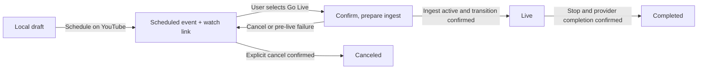

# Plan 045: Schedule livestream events and start the saved event manually

> Executor: implement the ordered slices below in an isolated checkout of current
> main. Read AGENTS.md first. Keep each slice independently testable. Planning
> authorizes no provider writes, implementation, release, or merge by itself.

## Status and decisions

- Status: IMPLEMENTED — S1–S5 complete; S6 production acceptance BLOCKED by the existing YouTube approval gate and unavailable authorized real-channel macOS/Windows run. Draft PR requested; no merge or release.
- Priority P1; effort L; risk MED–HIGH, principally provider lifecycle and recovery.
- Planned 2026-09-22 against merged main commit `3b7a3529` (includes PR #383).
- Plan storage: `/Users/orcdev/projects/videorc`, HEAD `15206746`, with unrelated
  user changes. Do not implement against that older checkout.
- Relevant source was read in `/Users/orcdev/projects/videorc-wt-scene-presets`
  at `6a831660`; compared YouTube, OAuth, main, storage and Studio provider files
  against `3b7a3529`: no drift in those inspected paths.
- User confirmed: create the platform's upcoming event now; open Videorc and
  explicitly click Go Live later. No timed encoder startup or automatic publishing.
- User confirmed first release: full YouTube scheduling, designed for other
  platforms later. Twitch and X extension contracts are documented below and
  are not included in v1.
- V1: one YouTube channel/event per schedule record; many records supported.
  Existing multistream can use one selected scheduled event per YouTube target.
  Scheduling one event must not schedule or publish unrelated destinations.
- No dependency on scene presets: scheduling stores event metadata, not camera,
  microphone, scene, recording output, or encoder configuration snapshots.

Before implementation, run `git diff --stat 3b7a3529..HEAD -- crates/videorc-backend
apps/desktop scripts package.json Cargo.lock` and reconcile the symbols below.
Preserve newer native scene-switch and Freeform work. Use branch
`feat/scheduled-livestreams`; commits follow existing `feat:` / `fix:` conventions.

## Platform investigation

Sources checked 2026-09-22. API availability and the app's account access are
different questions. No live provider account was mutated during investigation.

| Platform | Verified support and limitations | Proposed treatment |
| --- | --- | --- |
| YouTube | Broadcast API accepts title, description, future start time, privacy and audience declaration. Separate thumbnail upload targets the same video/broadcast ID. Existing Videorc adapter and OAuth scope are suitable foundations. | Complete v1; production depends on existing Google approval/enablement gate. |
| Twitch | Schedule API creates calendar segments with title, category, start, IANA zone and duration. No description/custom-thumbnail fields in that contract. One-off segments require Affiliate/Partner. | Later adapter with honest field support; never silently turn a one-off event into a recurring segment. |
| X | Current official OpenAPI describes scheduled create/list/get/update/delete and manual-live endpoints, including title, description, thumbnail media ID and `manual_publish`. Help pages still say scheduling is Media-Studio-only. | Real-account capability spike before inclusion; promising full-metadata follow-up, not “unsupported” and not production-verified. |
| TikTok / Instagram | Platform-owned scheduling experiences exist. Videorc currently uses manual RTMP for both; this investigation did not establish a supported public event-management API available to Videorc. | Show platform guidance only; do not label a local reminder as a published event. |
| LinkedIn | Official scheduled Live Events flow supports an announcement image and manual ingest/publish, with access tiers and approval requirements. No native Videorc integration. | Separate provider integration, not a scheduling add-on to generic RTMP. |
| Facebook | Meta's official SDK exposes scheduled LiveVideo states and planned start fields. Current scheduling/reference pages could not be retrieved; permissions, current thumbnail flow and account access remain unverified. No native Videorc integration. | Separate discovery/integration; do not promise parity from SDK fields alone. |
| Kick | Official help documents its streaming calendar; the public API index inspected does not document scheduling. No native Videorc integration. | Recheck public API/access before proposing an adapter. |
| Custom RTMP | Transport details identify where to send media; they provide no standard event metadata API. | No native scheduling capability; existing streaming remains available. |

Primary references:

- [YouTube create](https://developers.google.com/youtube/v3/live/docs/liveBroadcasts/insert),
  [list](https://developers.google.com/youtube/v3/live/docs/liveBroadcasts/list),
  [update](https://developers.google.com/youtube/v3/live/docs/liveBroadcasts/update),
  [bind](https://developers.google.com/youtube/v3/live/docs/liveBroadcasts/bind),
  [transition](https://developers.google.com/youtube/v3/live/docs/liveBroadcasts/transition),
  [stream creation](https://developers.google.com/youtube/v3/live/docs/liveStreams/insert),
  [resource model](https://developers.google.com/youtube/v3/live/getting-started),
  [thumbnail upload](https://developers.google.com/youtube/v3/docs/thumbnails/set).
- [Twitch schedule guide](https://dev.twitch.tv/docs/api/schedule/),
  [endpoint reference](https://dev.twitch.tv/docs/api/reference/#create-channel-stream-schedule-segment).
- [X official OpenAPI](https://docs.x.com/openapi.json) and
  [API-host copy](https://api.x.com/2/openapi.json): both fetched and parsed directly;
  `CreateScheduledBroadcastRequest`, `UpdateScheduledBroadcastRequest`, and
  `/2/broadcasts/scheduled/{id}/live` exist. Compare with the conflicting
  [Producer help](https://help.x.com/en/using-x/how-to-use-live-producer).
- [TikTok LIVE Events](https://support.tiktok.com/en/live-gifts-wallet/tiktok-live/tiktok-live-events),
  [Instagram scheduling announcement](https://about.fb.com/ja/news/2021/10/instagram_live_scheduling/).
- [LinkedIn scheduled events](https://learn.microsoft.com/en-us/linkedin/consumer/integrations/live-video/live-video-scheduled-live),
  [access tiers](https://learn.microsoft.com/en-us/linkedin/consumer/integrations/live-video/).
- [Meta official LiveVideo SDK](https://github.com/facebook/facebook-nodejs-business-sdk/blob/main/src/objects/live-video.js).
- [Kick calendar help](https://help.kick.com/en/articles/16727230-setting-up-scheduled-streams),
  [public API index](https://docs.kick.com/llms.txt).

## Current code and the gaps to close

1. `crates/videorc-backend/src/youtube.rs:17,29,285` separates public prepare
   parameters from an internal request. Internal `scheduled_start_time` exists;
   the public parameters currently contain account, target and video only.
   `prepare_youtube_broadcast` combines broadcast creation, stream creation and
   binding; defaults time to now + five minutes and sets both auto flags true:

   ```rust
   let scheduled_start_time = request.scheduled_start_time.unwrap_or_else(|| {
       (Utc::now() + Duration::minutes(5)).to_rfc3339_opts(chrono::SecondsFormat::Secs, true)
   });
   // contentDetails in the current immediate-Go-Live request:
   // "enableAutoStart": true, "enableAutoStop": true
   ```

2. `crates/videorc-backend/src/main.rs:2456` reads the one global metadata draft
   and passes `scheduled_start_time: None` to prepare. Its OAuth refresh handling
   is reusable, but replaying an entire multi-step create after a timeout is unsafe.
   RPC dispatch for YouTube starts near line 9754.
3. `crates/videorc-backend/src/oauth.rs:38–59` explicitly gates YouTube OAuth:
   `YOUTUBE_OAUTH_UNAVAILABLE_MESSAGE` says approval is pending; enablement is
   controlled by existing runtime/build flags. `youtube_provider_config` already
   requests `youtube.force-ssl`. Check actual release approval/configuration with
   the owner before enabling delivery; this plan does not remove the gate.
4. `streaming.rs:290` / `storage.rs:5010` hold one `StreamMetadataDraft` in
   `app_settings`; it has title, description and platform overrides, no event
   collection or thumbnails. Do not turn this singleton into the event database.
5. `use-studio.tsx:11623` loops OAuth destinations and always calls
   `streamTargets.youtube.prepare`. Selecting a scheduled event must bypass that
   broadcast-creation path. `runStartSession`, activation, cancellation, retained
   cleanup and Stop must carry the selected identity consistently.
6. `use-studio.tsx:11203` / `lib/capture.ts` / `lib/go-live-flow.ts` own cleanup.
   Today prepared YouTube targets are completion candidates even if not live.
   Applying that rule to a future event would destroy its intended lifecycle.
7. `youtube.rs:933` scopes secret references per destination to protect horizontal
   and vertical streams on one channel. Scheduled events need equally explicit
   event/target/stream ownership; never regress to one account-wide key slot.
8. `components/tabs/streaming-tab.tsx` already hosts destinations and metadata;
   `components/go-live-dialog.tsx` owns confirmation. Add scheduling here.
9. `main/index.ts:12158` / `resource_authority.rs` demonstrate picker → managed
   image copy → main-authorized backend resource registration. Reuse that security
   pattern, with a separate thumbnail kind/root, not a background masquerade.

Conventions: backend serde camelCase mirrors shared TS types; `anyhow` contexts
and provider error parsing; SQLite migrations in `Database::migrate`; secrets
stay in existing secret storage. Follow HTTP mock tests in `youtube.rs` and
provider integration tests in `hooks/studio-provider.integration.test.ts`.

## User experience

Livestream gains `Setup` and `Upcoming` views. Keep current streaming controls
intact. Upcoming has a compact chronological list and `Schedule stream` action.
Rows show thumbnail, title, YouTube/channel, date/time with zone, privacy and
status. Actions: Go Live, Edit, Copy link, Open on YouTube, Cancel event.
Drafts and attention-needed records remain visible; completed/canceled are in a
secondary history filter. Refresh explicitly; show stale/offline state.

Scheduling dialog:

- Exact connected YouTube channel; no silent use of whichever account is active.
- Required title; optional description and custom thumbnail with preview/replace.
- Required local date/time and searchable IANA time zone, initially device zone.
  Initial date/time suggestion is one hour ahead, editable. Show a resolved
  “22 Sep, 18:00 Europe/Madrid (UTC+02:00)” summary before submission.
- Privacy selection, default Private on a new form, and explicit made-for-kids
  answer. Cloning can prefill content, but review visibility/channel/audience.
- `Save draft` saves locally; `Schedule on YouTube` creates the platform event.
  Inline copy: “Your event appears on YouTube. Start it manually from Videorc.”
- Success shows the durable watch link. A partial thumbnail failure instead says
  “Event created; thumbnail upload failed” with Retry thumbnail/Open event.
- Reopening/editing a scheduled event reads fresh provider state. Unsaved edits
  prompt on dismissal. Duplicate creates a local draft with a new time and no
  remote IDs. Never duplicate on network retry.

The same selected event appears in Go Live confirmation, including channel,
visibility, title and time. Starting early/late is explicit; a passed scheduled
time is not proof the event ended. If multiple targets are enabled, list every
destination and whether it uses a saved event or immediate broadcast.

Use existing shadcn Dialog, Tabs, Field/Input/Textarea, Select/Command+Popover,
Button, Badge, Alert, ScrollArea and Sonner; add Calendar only via shadcn if needed.
Use the Videorc design skill: dense glass surfaces, semantic tokens, both themes,
Phosphor icons, keyboard focus restoration. Dialog-local Cmd/Ctrl+Enter submits
only when valid; no new global shortcut. Native file picker has accessible label.
Do not introduce a calendar-grid product or restyle unrelated tabs.

## Domain model and persistence

Add a backend-owned `scheduled_stream_events` table with indexed account/start
and unique `(provider, account_id, provider_event_id)` when remote ID is present.
Use versioned JSON for provider-specific fields, explicit columns for identity,
revision, lifecycle and timestamps. Add a durable operations table so request
retries and process restarts can resume the same intent. Additive migrations must
preserve existing destinations, global drafts, sessions and accounts.

`ScheduledStreamEvent` contains:

- Local UUID, schema version, revision, provider, stable channel/account ID,
  account label snapshot; optional preferred target ID/orientation as a UI hint.
- Title, description, privacy, made-for-kids, managed thumbnail asset ID/hash and
  thumbnail upload state. Keep requested values separate from last confirmed values.
- Start UTC instant, original IANA zone and local wall time/offset choice; optional
  future end/duration field can remain absent in YouTube v1.
- Provider broadcast ID/watch URL, optional bound stream ID and private secret
  reference, source ownership (`videorc-created` or explicit recovery adoption).
- Last confirmed provider lifecycle, last sync time, structured sanitized error,
  active preparation attempt/session association, created/updated timestamps.

Use orthogonal states: local `draft`; provider lifecycle
`scheduled | preparing | live | completed | canceled | missing | unknown`;
operation state `idle | pending | needs-retry | needs-reconciliation`. Thumbnail
pending/error is a substate, not proof the broadcast failed. Render these as clear
labels rather than one ambiguous generic “failed” flag.

Backend is authoritative; React state caches server snapshots only. Never store
OAuth tokens, raw stream keys, arbitrary absolute image paths or whole capture
settings in these records or renderer storage. Disconnect retains event metadata
with reconnect-needed state; it does not delete remote broadcasts.

Time conversion belongs in a tested backend helper. Use `chrono` plus an explicit
IANA-zone implementation (`chrono-tz` if no equivalent exists at execution).
Reject nonexistent DST wall times; ask earlier/later offset for ambiguous times.
Persist the resolved UTC instant and zone so travel/system-zone changes do not
move an existing event. Validate both renderer and backend; recheck future time
at provider creation. Do not invent a maximum scheduling horizon absent a verified
provider rule. Preserve the entered form when the provider rejects a time.

## Provider operations and failure rules

New typed renderer RPC family `scheduledStreams.*`: capabilities, list/get,
saveDraft, schedule, update, cancel, refresh, duplicate, prepareForGoLive,
releasePreparation, and recover. Mutations carry an operation UUID and expected
revision. Backend enforces account ownership, capabilities and operation leases.
Long operations return an operation handle promptly; use bounded provider requests
and `scheduledStreams.changed` events/pollable status. No database lock over HTTP.
These RPCs/events are renderer-only; remote/LAN allowlists do not grow.

### Create and edit

1. Validate and persist draft plus operation before calling YouTube.
2. Create `liveBroadcast` with event metadata, explicit `enableAutoStart=false`,
   `enableAutoStop=false`, monitor disabled to match direct-live activation.
   Keep appropriate existing latency behavior. Do not create an ingest stream,
   start capture or modify current destinations when scheduling.
3. Persist returned broadcast ID immediately; then upload the thumbnail through
   `thumbnails.set(videoId=broadcastId)`. Confirm metadata and return watch URL.
4. Resume thumbnail failure against the same ID. Never delete an otherwise valid
   advertised event just because its image failed.
5. Update fetches current data first and preserves mutable fields in every sent
   `part`; YouTube updates can erase omitted properties. Compare confirmed
   snapshots/revisions to detect external edits; offer Reload/Review changes,
   never silently force local stale metadata over YouTube Studio changes.
   Do not promise server-side compare-and-swap unless its contract is verified.
6. Made-for-kids may have a different update surface than insert; establish the
   supported update call during S1. Until verified, keep the existing declaration
   immutable in Edit and link to YouTube Studio; never silently omit a change.

The existing scope covers these methods. Live-enabled account and custom-thumbnail
eligibility failures need separate actionable messages. Title 1–100 characters;
description at most 5,000; mirror provider character restrictions and validate
actual Unicode correctly. Limits are adapter constants with tests.

Thumbnail v1 accepts JPEG/PNG via a main-process picker; validate actual bytes,
decode dimensions, reject unsupported/animated/corrupt data, cap decoded pixels
and use a managed immutable copy. Product upload cap: 2 MB (deliberately stricter
than the currently documented 50 MB API maximum), with visible validation and
16:9/1280×720 guidance. No URL upload or implicit source-image cropping. No image
editor required. New main/preload typed IPC returns an opaque asset ID and safe
preview URL; backend resolves only registered managed-thumbnail IDs. Re-register
valid managed copies after app restart; retain referenced draft/event assets.
Do not offer “remove thumbnail from YouTube” without a verified remote reset API;
allow remove before publish and replace afterward.

### Retry, reconciliation and cancellation

- Deduplicate operation IDs in durable storage and disable duplicate form submits.
  Concurrent edits/start/cancel to the same event serialize through revision/lease
  checks; unrelated events remain operable.
- A create timeout may mean YouTube created the event. Mark unknown; do not resend
  insert blindly. If no ID was durably received, list owned upcoming broadcasts
  with pagination and let the user explicitly select a candidate/open Studio.
  Title/time are clues, never an automatic identity match. Confirm ownership and
  lifecycle before adoption. Preserve evidence when abandoning an unknown operation.
- Refresh known IDs in bounded batches; use the documented exclusive list filters
  (`id` or `broadcastStatus` or `mine`, not incompatible combinations).
  Retry reads with bounded backoff; honor rate-limit signals. No tight perpetual
  polling or scheduled-time alarm is needed. Refresh on view entry, explicit
  refresh, resume/reconnect and before each mutation/Go Live.
- Unauthorized: refresh once at a safe request boundary; reconnect when required.
  Quota/rate limit, offline, account mismatch, externally deleted/ended event,
  invalid time and denied thumbnail upload remain distinct errors.
- Cancel requires a clear provider deletion confirmation and refreshed non-live
  state. YouTube has no generic “canceled” transition: delete the unstarted
  broadcast, then retain a local canceled tombstone. Never cancel a live event
  through Delete; route its owner to Stop. A lost delete response is reconciled
  by get/404, not by announcing success without evidence.
- Local draft deletion is distinct from remote cancellation. No automatic remote
  deletion when removing a destination, disconnecting an account, closing the
  dialog/app, or encountering a partial multistream failure.

### Start and stop the exact saved event

`prepareOauthTargetsForGoLive` dispatches selected scheduled targets to
`scheduledStreams.prepareForGoLive`; unselected targets keep their immediate path.
Selection stores local event ID, never just a loose provider ID pasted into config.
Scheduled target preparation uses the event's confirmed metadata, not the singleton
`StreamMetadataDraft`. Editing the current instant-stream title must not rename a
future event; editing an event must not overwrite the instant-stream draft.
Confirmation and session title copy must reflect the selected event. Preserve
per-target event metadata when other destinations use their usual global overrides.
Resolve event/account again on the backend and acquire a preparation lease.

Prepare refreshes lifecycle/binding. Create and bind a dedicated stream only when
needed, using the actual per-target profile/orientation. Preserve existing binding
when compatible. If an external active binding, unknown stream-create result or
incompatible profile is discovered, report repair/confirmation; do not silently
replace another encoder's ingest. Persist newly created resource IDs before the
next request; use event/target-specific secret references and existing secret store.
Never let preparing tomorrow's event overwrite today's active target credentials.

After explicit Go Live confirmation, reuse existing preflight/start/ingest-active
wait/YouTube transition and confirmation paths. No new `liveBroadcasts.insert` may
occur for the saved target. Record the confirmed session/attempt owner so late
responses or a renderer reload cannot switch or finish another event.

If start fails before the event becomes live, stop any owned failed ingest, release
preparation and preserve the scheduled broadcast for Retry. Canceling Go Live
confirmation must preserve future events. If a transition result is unknown,
reconcile provider state before choosing retry vs completion. If live was confirmed
and the session ends, explicitly complete that exact broadcast and mark it ended
only on provider confirmation; retain cleanup-needed state otherwise.

Carry lifecycle provenance through existing ownership/retained-cleanup helpers:
immediate ephemeral broadcast versus persistent scheduled event; attempt/session
ID; activation phase. Never infer cleanup policy from “has broadcast ID.” On crash
or restart, reconcile provider/session ownership before enabling another start;
no automatic go-live, deletion or completion of unrelated events.



## Scope and implementation slices

Allowed existing paths: backend `main.rs`, `state.rs` only for scheduling service
ownership, `storage.rs`, `youtube.rs`, `streaming.rs`, `oauth.rs` only for capability
checks/reusing refresh, `resource_authority.rs`, and associated tests; shared
`backend.ts`, Electron IPC contract and tests; main/preload indexes; renderer
`use-studio.tsx`, provider integration tests, `lib/capture.ts` and tests,
`lib/go-live-flow.ts` and tests, streaming tab, Go Live dialog/tests and command
palette; package/Cargo manifests and lockfiles only for justified dependencies or
maintained smoke entries. New scheduling modules/components/tests belong next to
those owners. New thumbnail asset main helper/tests may live under `src/main/`.

Explicitly out of scope: media compositor, geometry, encoding profiles, session
transport architecture, remote intents/LAN projection, new platform integrations,
Google gate bypass, recurring series, automatic startup/OS jobs, cloud scheduler,
cross-device draft sync, bulk external-event import, AI thumbnail generation,
calendar integrations, automatic promotional posts or new pricing rules.

### S1 — Lock provider capability and lifecycle contracts

Create `scheduled_streams.rs` and focused provider DTO/helper tests; add shared
TS models in `shared/backend.ts`. Refactor YouTube HTTP primitives minimally so
create-event, get/list, update, thumbnail, create-stream/bind are separable and the
existing immediate helper retains its behavior. Add capability results including
Google gate, connected channel, reconnect and feature support. Establish immutable
audience-edit behavior or verify its supported update API before enabling it.
Test auto flags false for scheduled creation, original immediate defaults retained,
proper query filters and provider errors using local HTTP fixtures.

Verify: `cargo test -p videorc-backend youtube`,
`cargo test -p videorc-backend scheduled_streams`, `pnpm typecheck` → pass.

### S2 — Persist drafts and journal provider operations

Add additive SQLite tables and storage methods, explicit revisions/leases and
sanitized typed errors. Implement time validation in `scheduled_streams.rs` (or
`scheduled_streams_time.rs`), service orchestration in `scheduled_streams_service.rs`,
and renderer-only RPC dispatch. Tests reopen a real temporary DB; inject failures
between remote response and persistence, after ID save, and during retry. Ensure
unknown create never generates a second insert automatically. Reject stale edits,
channel swaps and concurrent duplicate start/cancel. Do not hold mutexes over HTTP.

Verify: `cargo test -p videorc-backend scheduled_streams`,
`cargo test -p videorc-backend storage`, `cargo test -p videorc-backend oauth`,
`pnpm typecheck` → pass, including migration and restart cases.

### S3 — Add thumbnail transport and Upcoming management UI

Add `src/main/scheduled-stream-thumbnail.ts` and tests; typed import IPC through
preload/contract; separate backend managed-thumbnail authority. Add
`hooks/use-scheduled-streams.ts`, `components/scheduled-streams.tsx`,
`components/schedule-stream-dialog.tsx`, and focused `.test.ts` tests (current
desktop collection convention). Integrate in streaming tab and command palette.
Implement create/edit/duplicate/cancel/recovery, loading/empty/offline/reconnect/
partial states and keyboard focus. Keep provider operations in the backend, not
a chain of renderer HTTP calls. Lazy-load scheduling UI to protect eager assets.

Verify: focused desktop tests then `pnpm typecheck`, `pnpm lint`,
`pnpm format:check`, backend thumbnail authority tests → pass. Inspect both themes,
long titles, long channel lists, 200% zoom and keyboard-only file/form flow.

### S4 — Attach the scheduled event to manual Go Live

Update selection/prepare dispatch, per-target profile handling, lifecycle ownership
and cleanup policy together. Add provenance without changing current instant
stream behavior. Prepare scheduled and immediate destinations in the same
confirmation; report partial setup explicitly. Never silently continue without
the selected scheduled destination. User may explicitly choose ready destinations.
Disable edit/cancel on an event owned by a preparing/live attempt.

Verify provider tests assert one event insert across schedule + later start,
identical event ID through activation/chat/completion, cancel/rejected start leaves
event scheduled, lost transition reconciliation, two events same channel, two
orientations with separate keys, one scheduled plus one immediate target, and
late old-session callbacks cannot touch a new owner.
Commands: `pnpm --filter @videorc/desktop test`,
`pnpm smoke:platform-lifecycle`, `pnpm smoke:streaming-secrets`,
`cargo test -p videorc-backend scheduled_streams` → pass.

### S5 — Prove app restart and failure recovery end to end

Add maintained `scripts/smoke-scheduled-streams-app.mjs`, helpers/tests as needed
under `scripts/lib/`, package command `pnpm smoke:scheduled-streams`. Use isolated
app data, fake local provider endpoints through an existing dev-only injection
pattern and owned process cleanup. Never expose arbitrary production API URLs.
The smoke must drive actual renderer controls/provider actions, not a parallel
implementation of scheduling. Fake-provider mode creates no public events.

Scenario: create two future events with different thumbnails; quit/reopen; edit
one without changing the other; fail then retry thumbnail; simulate lost create
response; cancel one; select the other and cancel Go Live before activation;
retry and stream to a local RTMP receiver; stop; inspect finished media with the
existing analyzer and assert exact provider call IDs/counts. A fake clock crossing
the scheduled time must produce zero session starts and zero live transitions.

Verify: `pnpm smoke:scheduled-streams`, `pnpm test:scripts`,
`pnpm smoke:multistream`, `pnpm smoke:remote-control` → pass. Last gate proves
existing remote start still respects confirmation and scheduling RPCs remain denied.

### S6 — Production provider acceptance and release readiness

Run all gates below against the final branch and its current base; report genuine
base failures separately rather than increasing budgets or weakening checks.
Perform an authorized private/unlisted real-channel cycle on macOS and Windows:
create with image, verify remote upcoming page/link/metadata, restart app, edit
time/image, manually start the same ID, confirm watchable ingest and completion.
Create a second disposable private event and cancel it. Test a real denied
thumbnail/account state when available, otherwise label mock-only coverage.
Do not automate public event publication for a smoke. Live account writes require
an explicitly selected test channel and approval for that acceptance run.

If Google enablement/credentials/test channel are unavailable, mocks can complete
the implementation but real-provider acceptance stays BLOCKED with that exact
reason. Never mark scheduling production-ready from fake-provider results alone.

## Verification gates and completion criteria

Commands from this repo (Node 24, pnpm 11; ensure PATH selects them):

| Coverage | Command / required evidence |
| --- | --- |
| TS quality | `pnpm typecheck`, `pnpm lint`, `pnpm format:check` |
| Tests and build | `pnpm --filter @videorc/desktop test`, `pnpm test:scripts`, `pnpm build` |
| Rust quality | `cargo fmt --check --all`, `cargo test -p videorc-backend`, `cargo clippy -p videorc-backend -- -D warnings` |
| Dependencies | `pnpm audit:deps` |
| Renderer bytes | `pnpm check:renderer-assets`; compare clean current base if already over budget |
| New behavior | `pnpm smoke:scheduled-streams` (add in S5) |
| Existing provider behavior | `pnpm smoke:oauth`, `pnpm smoke:oauth-guards`, `pnpm smoke:provider-readiness`, `pnpm smoke:platform-lifecycle`, `pnpm smoke:streaming-secrets`, `pnpm smoke:multistream` |
| Studio/start regression | `pnpm smoke:recording-studio`, `pnpm smoke:record-latency:gate` |
| Remote contract | `pnpm smoke:remote-control` |
| Device/platform acceptance | Real channel cycle on macOS/Windows; `pnpm smoke:recording-studio:devices` on permissioned macOS when the touched capture paths require it |

All applicable commands exit 0; blocked platform/account gates have precise
evidence, not a generic waiver. No encoding changes are planned; if required,
expand verification to `pnpm smoke:recording-matrix` and obtain scope review.
Use the shadscan-pre-commit skill baseline/floor protocol before commits.

Additional automated assertions: Europe/Madrid DST gap/fold; half-hour-offset zone;
changing system zone; past/invalid date; Unicode and length boundaries; corrupt,
oversized and spoofed image; path traversal/wrong resource kind; disconnected
account; missing approval flag; 401 refresh/403/429; external event edit/deletion;
unknown schema; storage failure; repeated request UUID; duplicate thumbnail retry;
close/reopen during provider operation; deletion while start lease held; no secrets
in event payload/logs/remote projection; no event created by merely opening a form.

Done means the advertised event survives restart with the same watch link, its
metadata/image can be changed, cancellation is explicit, and manual Go Live uses
and completes that same event. The clock never starts media by itself. Existing
instant and mixed-platform streaming still pass. Update this plan/index with
actual tests, limitations and PR only when implementation is authorized.

## Follow-up platform slices (not part of YouTube v1)

- X first prove the live official contract with Videorc's allowed account: scopes
  `broadcast.read`/`broadcast.write` or permitted user-token auth, source creation
  and source ID semantics, thumbnail media upload category/access, scheduler ID
  versus live broadcast ID, `manual_publish=true`, manual-live and end behavior.
  Treat the schema's source identifier as potentially secret until its relationship
  to `rtmp_stream_key` is verified. Existing `x_live.rs` uses a different legacy
  create/publish route; do not assume current OAuth/connect flow grants this API.
  Keep disabled behind capability proof until documented/manual ambiguity is resolved.
- Twitch one-off scheduling requires account type discovery, new
  `channel:manage:schedule` consent and reconnect for existing tokens. Required
  duration 30–1380 minutes; title max 140; optional category. Show “Description and
  thumbnail are not published to Twitch.” Starting streaming still uses current
  channel metadata/ingest behavior; a calendar segment ID is not a live broadcast
  ID and must never enter YouTube-style completion cleanup. Recurrence is separate.
- Multi-platform event groups come after adapters: one local group with independent
  destination outcomes, edits and retries; no claim of atomic cross-provider create.
  Keep a successful YouTube event if another platform fails. Do not erase field
  differences through a misleading shared form.

## Stop conditions and maintenance

- Stop for scoped design revision if current main already has scheduling, provider
  lifecycle ownership has moved, or exact event reuse needs a media-core rewrite.
- Preserve Google approval gate; report missing access rather than enabling it.
- Never patch unknown create responses with unconditional POST retries, complete
  an unstarted scheduled event during cleanup, or fall back to a new instant event
  when the selected event cannot start.
- If a required check fails twice after a focused correction, record evidence and
  separate regression from known baseline; do not expand into unrelated fixes.
- Keep provider API capabilities/limits verified as docs evolve. Maintain tests
  whenever lifecycle, token scopes, target identity, thumbnail authority or session
  cleanup changes. Keep recovery journals and asset references coherent on deletion.
- Investigation covered the scheduling/provider/UI/storage/start paths, not a
  general security or media-performance audit. No app source changed and no tests
  were run for this documentation-only planning task.

## Execution drift reconciliation — 2026-09-22

Execution worktree: `/Users/orcdev/projects/videorc-wt-scheduled-livestreams`,
branch `feat/scheduled-livestreams`, base `f0b775f98`. Main advanced with Freeform
PR #384 after planning. Reviewed shared/provider changes: they concern scene
transform commit acknowledgements and keyboard gesture guards, not streaming
preparation/lifecycle. Preserve these changes and its newly added smoke gate.
The scheduling design remains applicable. Plan copied into this isolated worktree
before dispatch so the executor has the complete authoritative instructions.

Execution baseline findings:

- Provider readiness reports YouTube paused; no selected/authorized real test channel
  is configured for this run. Real-provider S6 acceptance is externally blocked;
  implementation and fake-provider acceptance continue. No provider writes authorized.
- Clean-base Rust audit fails on rustls 0.23.40 (RUSTSEC-2026-0285, fixed >=0.23.45).
  Reviewer authorizes a narrowly scoped lockfile patch to the minimum fixed release
  alongside the planned timezone dependency, with normal Rust/audit verification.
  No advisory suppression or unrelated dependency upgrade is authorized.
- Shadscan measured baseline/floor 41.
- Node baseline: 1,439 tests passed across 253 suites.
- Desktop baseline: 185 files passed, 1,868 tests passed and one existing skip;
  production build passed. Clean-base renderer assets already exceed the fixed
  budget: 2,006,827 raw / 388,816 gzip bytes versus 2,000,000 / 385,000. Keep the
  budget unchanged and compare the final branch's eager graph with this baseline.
- Thumbnail picker registration also requires the existing renderer IPC security
  classification in `shared/renderer-security-policy.ts`; this bounded security
  wiring is approved within S3's scope.
- Typed scheduling requests/events require `shared/backend-rpc-contract.ts`.
  S4 also needs a bounded `preflight.rs` extension: resolve the selected event's
  owned, confirmed metadata for scheduled destinations, without making the global
  instant title mandatory for an all-scheduled setup or allowing a scheduled title
  to substitute for an unrelated instant destination's metadata. Its struct-literal
  tests and the existing debug-only Studio smoke bridge are included in this scope.
- S5's managed thumbnail fixture command needs a bounded addition to
  `main/smoke-command-security.ts` and its tests. It must remain unavailable in
  packaged/release command surfaces and accept only the existing authorized
  fixture root; this does not extend remote or LAN commands.
- A clean-base source-complete native-preview smoke failed at source-to-present
  p95 113 ms versus the 100 ms limit while a separate Cargo compilation was active.
  Its initial attempt had timed out waiting for a cold backend build. This is not
  evidence of a scheduling regression or a timing waiver; run final native timing
  checks without competing builds and investigate any repeated final failure.

- Clean-base `smoke:platform-lifecycle` reproduces the same missing
  `./layout-framing-memory` module as the implementation branch. The existing
  `scripts/lib/compile-capture-module.mjs` transpiles only capture/shared protocol
  and omits capture's existing runtime helper and renderer protocol barrel. A
  bounded verification-helper correction (and its focused test) is approved so
  lifecycle, secrets and recording gates exercise the intended code. No product
  framing/layout behavior changes are included.

## Execution verification record — 2026-09-22

Reviewer checks on the implementation worktree:

- TypeScript typecheck and lint passed. Full desktop suite passed: 188 files,
  1,884 tests, one existing skip. Node scripts passed: 1,441 tests.
- Production desktop build passed. Renderer eager assets are 2,013,213 raw /
  390,051 gzip bytes, a +6,386 / +1,235 delta from the clean base. The unchanged
  asset ceiling still fails; scheduling management/form code remains lazy-loaded.
- Combined dependency audit passed after the narrowly scoped rustls fix.
- Platform lifecycle and streaming-secret smokes passed after the documented
  compile-helper correction. Provider readiness reports YouTube paused and
  missing live-test prerequisites; it is not evidence of a real provider cycle.
- Final full Rust run passed: 2,200 backend tests, 80 helper tests and one wire
  test; nine existing ignored tests. Rust formatting and clippy passed. Review
  corrections cover in-place thumbnail mutation, exact upload bytes, operation
  finalization and explicit unknown-ingest recovery.
- Final TS formatting, scheduling app smoke and visual/keyboard checks passed.
  The complete `pnpm smoke:recording-studio` bundle passed, including enforced
  latency, native preview lifecycle/reattachment and real ScreenCaptureKit recording.
  No production readiness claim is made.

- Visual verification uses a bounded dev-only Electron zoom command, covered by
  packaged-command denial tests, so 200% acceptance changes the real CSS viewport
  instead of applying an inaccurate `body.zoom` simulation. This small extension
  stays on the existing authenticated local smoke surface.

- Final recovery review found that an accepted-but-lost ingest-stream insert was
  safely blocked but had no usable in-app repair path. Complete S4 recovery with
  explicit adoption of an owned, inactive, compatible stream. Extend the existing
  candidate/recover RPCs with a candidate kind; never auto-match by title, expose
  ingestion credentials in candidates, replace another binding, or adopt a stream
  already owned by another local event. Keep the original broadcast/watch ID and
  checkpoint the chosen stream before continuing preparation. Verify lost-response
  recovery without a second stream insert, ownership/profile rejection and redaction.
  The official [liveStreams.list contract](https://developers.google.com/youtube/v3/live/docs/liveStreams/list)
  supports `mine=true` with pagination and the existing force-ssl scope.

- Selecting a saved event now atomically enables global streaming and the matching
  YouTube destination while retaining recording intent and unrelated targets. A
  focused pure-helper test covers this transition; provider preflight still owns
  approval/account blockers. The scheduling smoke reselects through the actual UI
  after recovery and waits for output-path readiness before pressing Start.
- OAuth callback and OAuth guard app smokes passed on the final source.

- Final reviewer-owned `smoke:scheduled-streams` passed: two events and uploaded
  thumbnails, partial-upload retry, restart/edit isolation, explicit broadcast and
  ingest recovery after accepted-but-lost responses, cancellation, and real Studio
  confirmation/Start/Stop reuse the exact event ID. Both the local recording and
  received RTMP artifact passed ffprobe/ffmpeg analysis. No clock-driven start
  occurred and recovery issued no duplicate create. Final dark/light and real
  Electron 200% zoom captures were reviewed; scrolling keeps the footer separate
  and reaches thumbnail/audience controls. Dirty-dismiss/focus restoration passed;
  file-picker cancellation is unit-covered, not claimed as a manual OS-dialog test.
- Existing multistream and remote-control app smokes passed.

- The enforced Record/Stop latency gate passed five real renderer cycles with
  analyzed 1080p30 artifacts: cold click-to-recording 123 ms, warm p95 73 ms;
  cold click-to-idle 105 ms, warm p95 109 ms. All five used the armed compositor.
  App-quit-during-finalization, Freeform, captions, noise cleanup and all-layout
  recording artifact smokes also passed inside the recording-studio bundle.

## Final review and remaining acceptance

S1–S5 implementation is complete and both review corrections are accepted.
S6 remains BLOCKED for real-channel production acceptance: YouTube's existing
Google approval gate is unchanged, and no authorized private/unlisted test channel
was selected. No real provider events were created. Packaged macOS/Windows
real-channel create/edit/thumbnail/live/stop/cancel acceptance is still required.

The unchanged renderer asset ceiling also fails: final eager graph 2,013,213 raw /
390,051 gzip bytes versus base 2,006,827 / 388,816 and limits 2,000,000 / 385,000.
Delta is +6,386 raw / +1,235 gzip. Do not treat the draft PR as release-ready.

Final source verification passed: TS typecheck/lint/format, desktop 1,884 tests
(one existing skip), Node 1,441 tests, production build, Rust 2,200 backend + 80
helper + one wire test (nine existing ignored), Rust fmt/clippy, combined advisory
audit, scheduled-streams, OAuth, OAuth guards, provider lifecycle, streaming-secret,
multistream, remote-control and the entire recording-studio bundle. Provider
readiness reports the external gate; its successful command exit is not provider
acceptance. The optional camera/device-only suite was not required for this change
to scheduling and start orchestration; no camera/compositor/encoder implementation
changed. The default bundle did exercise real screen capture and native preview.

Two desktop startup-wait tests and one script mock-listener readiness test failed
under concurrent heavy compilation, then the complete suites passed on quiet
reruns without changing those tests. No budgets or production gates were weakened.

Maintained evidence is summarized here; temporary logs/media remain outside Git.
Final precommit Shadscan score: 41/100, matching the measured baseline/floor of 41.
Reviewer log prefixes: `/tmp/videorc-plan045-`; final scheduling run is
`smoke-scheduled9.log`, broad recording run `recording-studio-final.log`.
